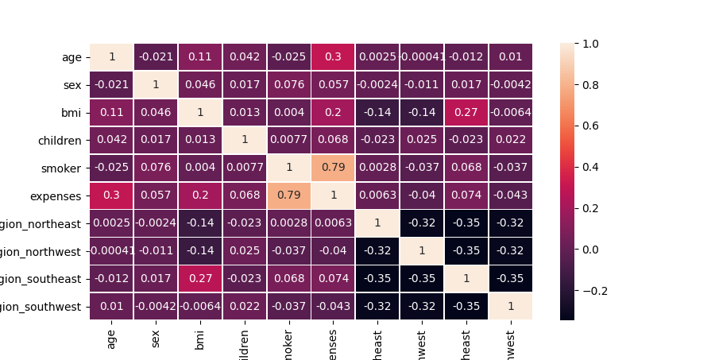
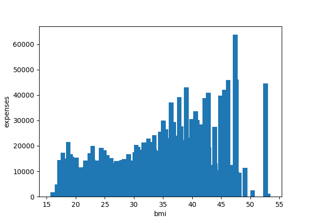

# Medical Insuranse Premium
<hr>
This is a Data Science project in which i have to create a algorithm to detect if the person need premium plan in Medical Insurance based on: age, bmi, number of children, sex, is smoker, and region(dataset region)

## Data Cleaning
First I have to some some adjust in the data, first I convert sex and smoker to numerical values(1 and 0), to the regions I created a column for each of them that looks like this:

region_northeast | region_northwest | region_southeast | region_southwest
--- | --- | --- | --- 
1 | 0 | 0 | 0
0 | 1 | 0 | 0
0 | 0 | 1 | 0
0 | 0 | 0 | 1 

**1** represent the region and **0** says that it's not the region.

It's to prevent higher numerical values influence the prediction, 

If northeast region  is **1** and northwest region is **2**, the AI can think that northwest region is better or worse than northeast region.

## Analyses

### Heatamp

By the chart, smoking has the most relation with expenses, followed by age and bmi(body mass index, how fat the person is)
### Smoking

This graph shows that people who smoke has higher expenses than who don't

### Age

This graph shows that age influence expenses, you can see that expenses grows when age grow

### BMI

This shows that BMI also influence expenses, but in this has some BMI with fewer people with high or low expenses


This shows that people with 2 and 3 children have more expenses than the others

### Predictions

I created two type of algorithm, one tries to predict the expenses values, and the other you set a expense value that if higher the person should use premium, and the algorithm, based on the classify if the person should use the premium, 

For the one that predict i used Polynomial Regression, and the one that classify I used RandomForestClassifier

#### Scores

Prediction: prediction had an average 30% difference between real values and predicted;

Classifier: had 95% accuracy.

## How to use

You should have python3,<br> 
preferable 3.7 or higher

1.<br>
```pip install -r requirements.txt```<br>
or<br>
```pip3 install -r requirements.txt```

2.<br>
Go to the `core` folder

add the data in the `input_to_predict.csv` file

3.<br>
run `python3 predict.py predict` to predict expense<br>
or<br>
`python3 predict.py classify` to classify

if you are on Windows remove '**3**' in the command

4.<br>
The output is on `output_predicted.csv` file
